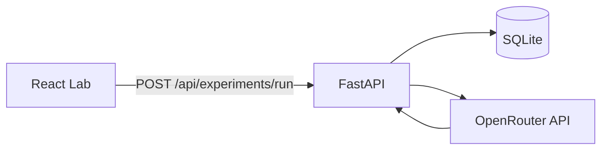

# PromptLab AI — Prompt Engineering Study Tool

Full-stack app to **generate**, **compare**, **score**, and **optimize** prompt variants with an automated evaluation pipeline (parallel completions, rubric scoring, bias scan, consistency audit, winner narrative, and rewrite suggestion). All LLM calls go through **[OpenRouter](https://openrouter.ai/)** (OpenAI-compatible API, any routed model). Dark, motion-rich UI; SQLite storage with a normalized schema that can grow into Postgres.

## How the project works (end-to-end)

1. **You define prompts** in the Lab: one **base** prompt plus **1–5 full alternative prompts** (each variation is a complete instruction, not a fragment).
2. **Backend creates an experiment** in SQLite (`experiments` + `variations` rows).
3. **Generation (parallel)** — For each variation, the app calls OpenRouter’s chat completion API with that prompt and collects answers concurrently.
4. **Scoring (parallel per answer)** — For each answer, a second model call returns JSON scores (clarity, relevance, depth, creativity 0–10) plus short reasoning; a separate call flags **bias** risks.
5. **Weighted total** — Your UI weights are normalized and combined with those four scores to rank variants; the highest total is the **winner** (strength meter ≈ that score scaled to 0–100%).
6. **Consistency check** — One more call sees all answers together and reports alignment, contradictions, and shared themes.
7. **Winner story + optimization** — The API explains why the winner won and proposes a tightened **improved** version of the winning prompt.
8. **Persistence & UI** — Results are saved (`variation_results`); History and detail views reload from the DB; you can export **JSON** or **PDF**.



## Repository layout

```
prompt-engineering/
├── backend/          # FastAPI + SQLAlchemy + OpenRouter
├── frontend/         # React + Vite + Tailwind + Framer Motion + Recharts
├── render.yaml
└── README.md
```

## Prerequisites

- Python **3.10+** (3.11+ recommended)
- Node **18+**
- **[OpenRouter](https://openrouter.ai/)** API key (`OPENROUTER_API_KEY`)

## Run locally

### 1. Backend

```powershell
cd backend
python -m venv .venv
.\.venv\Scripts\Activate.ps1
pip install -r requirements.txt
copy .env.example .env
# Edit .env: set OPENROUTER_API_KEY (and optional DEFAULT_MODEL)
```

**Recommended on Windows** (avoids `WinError 10013` on `0.0.0.0:8000` — reserved/blocked ports or policy):

```powershell
.\run_dev.ps1
```

Or manually:

```powershell
uvicorn app.main:app --reload --host 127.0.0.1 --port 8010
```

The Vite dev server proxies `/api` to **`http://127.0.0.1:8010`** by default (`vite.config.ts`). If you use another port, set `VITE_API_PROXY` in `frontend/.env`.

API: `http://127.0.0.1:8010` · OpenAPI: `http://127.0.0.1:8010/docs`

### 2. Frontend

```powershell
cd frontend
npm install
npm run dev
```

App: `http://127.0.0.1:5173`

Development uses the Vite dev server **proxy**: requests to `/api` forward to the backend (see `vite.config.ts`, `VITE_API_PROXY`).

### 3. Production build (frontend)

```powershell
cd frontend
npm run build
npm run preview
```

## Environment variables

| Variable | Where | Purpose |
|----------|--------|---------|
| `OPENROUTER_API_KEY` | Backend | Bearer token for OpenRouter |
| `OPENROUTER_BASE_URL` | Backend | Default `https://openrouter.ai/api/v1` |
| `DEFAULT_MODEL` | Backend | Default slug if UI leaves model blank |
| `OPENROUTER_HTTP_REFERER` | Backend | Optional; OpenRouter rankings |
| `OPENROUTER_APP_TITLE` | Backend | Optional; shown in OpenRouter dashboard |
| `DATABASE_URL` | Backend | Default `sqlite:///./promptlab.db` |
| `CORS_ORIGINS` | Backend | Comma-separated allowed origins |
| `VITE_API_URL` | Frontend build | Public API URL (empty = same-origin / proxy) |

## Deploy

### Backend (Render)

1. New **Web Service**, root directory `backend`.
2. Build: `pip install -r requirements.txt`
3. Start: `uvicorn app.main:app --host 0.0.0.0 --port $PORT`
4. Set `OPENROUTER_API_KEY`, `CORS_ORIGINS` (include your frontend domain).

See `render.yaml` as a starting point.

**Note:** Render’s filesystem is ephemeral. SQLite works for demos; for durable history use a managed database and point `DATABASE_URL` at Postgres.

### Frontend (Vercel)

1. Import the `frontend` folder as a Vite project.
2. Build: `npm run build`, output: `dist`
3. Set `VITE_API_URL` to your API origin (no trailing slash).

## API overview

- `POST /api/experiments/run` — base prompt, variations, weights, OpenRouter model slug; runs full pipeline.
- `GET /api/experiments` — recent experiments.
- `GET /api/experiments/{id}` — full detail.
- `DELETE /api/experiments/{id}` — remove a record.
- `GET /api/health` — health check.

## License

Use and modify for your own learning and projects.
